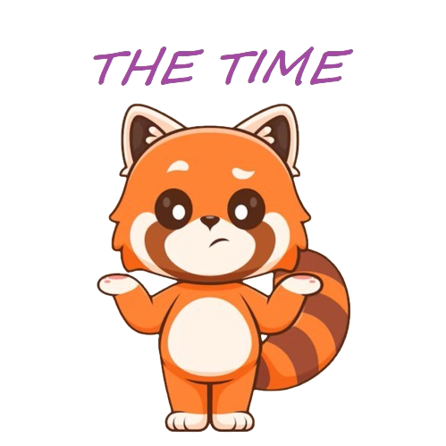
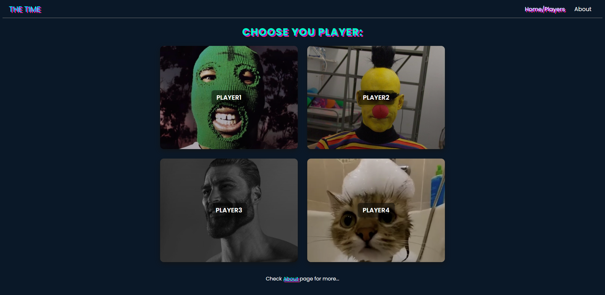
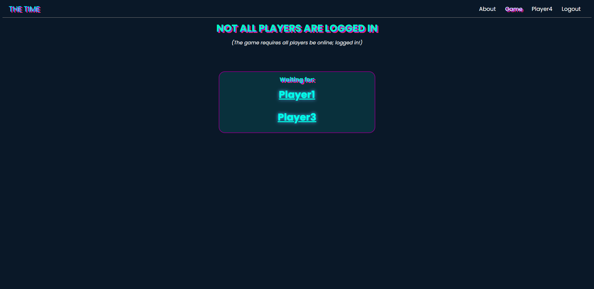
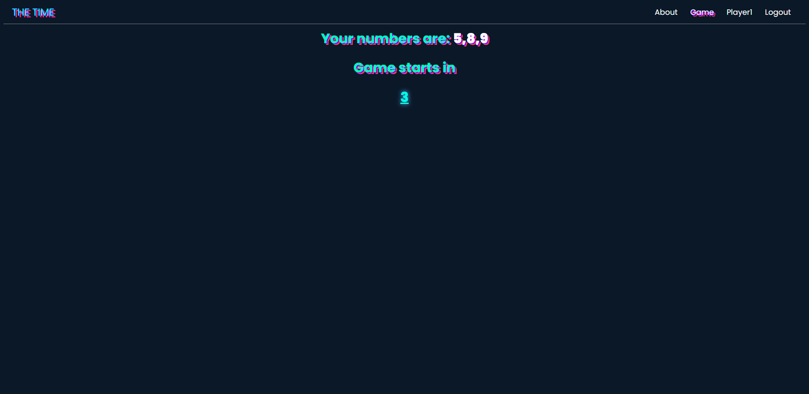
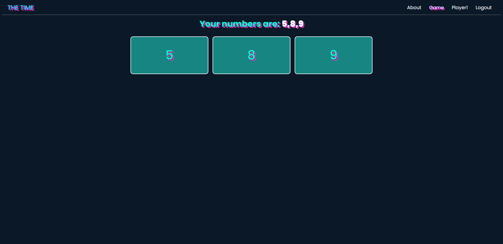

# The Time

<!--  -->

  

A real-time web application build with Firebase and Angular, using Realtime Database for data synchronization and Static Hosting for displaying frontend content.

App needs minimum 2 players. (_Keep in mind that there's only 1 lobby..._)

## About

After __selecting a player__, each user receives __random numbers between 0 and 10__. Once all players have joined, the game begins and a __5 - seconds countdown__ starts.

The main goal of the game is for players to __synchronize their card plays__ (_in this case - numbers_) without communicating. Each player must play their card (_the numbers they were assigned in the start of the game_) in ascending order as the countdown progresses. If a player plays their card (_number_) too early or too late, the game ends. If all players successfully coordinate their numbers, the game is won.

## Screenshots

Some images from the game:

- Players/Home page:

 

- Waiting for players:

 

- Countdown:

 

- Player's Card/Numbers:

 

- Small video presentation:

There are still many things to be improved and added.